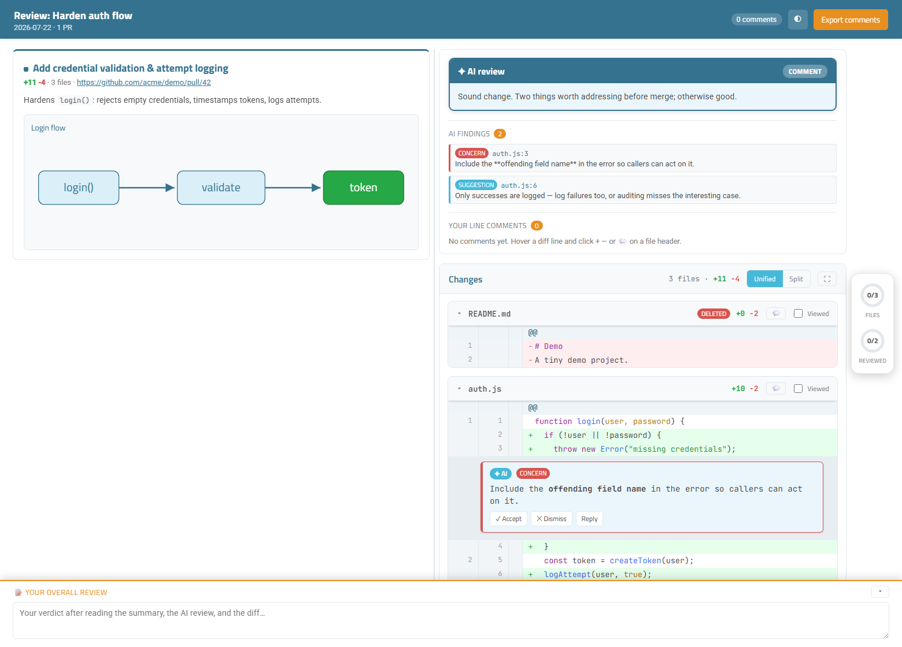

# Trace Review

> **Review local or pull-request changes in a focused HTML interface.**

Trace Review turns a working-tree diff, branch range, or pull request into a self-contained interactive review page with readable diffs and whole-file views.

The language model does not generate the HTML document. It creates structured review content when requested; local scripts validate it and combine it with the parsed diff and a checked-in template.

<picture>
  <source media="(prefers-color-scheme: dark)" srcset="docs/assets/review-interface-dark.png">
  <source media="(prefers-color-scheme: light)" srcset="docs/assets/review-interface.png">
  
</picture>

## How it works

```text
local diff or pull request
  → prepare collects facts and the diff
  → the LM writes one structured result
  → finish validates it and builds review.html from the template
```

The result is a portable local page with light and dark themes, diff controls, review progress, comments, Markdown export, and optional confirmed publication as a native GitHub review.

Drag across a contiguous block of diff gutters to comment on the range, create
a GitHub-compatible suggested change, or export a syntax-colored before/after
diff. The selectable preview can be copied as a PowerPoint-friendly editable
table or downloaded as HTML, SVG, or PNG for websites, presentations, and
documentation. Image, SVG, and PowerPoint exports follow the selected layout:
a full side-by-side comparison or a narrower compact unified diff. PowerPoint
exports use tightly spaced rows while preserving code indentation; side-by-side
columns flow independently so added and removed runs do not create blank gaps.
The export dialog defaults to no background and also offers presentation-ready
color presets. Editable PowerPoint copies include the selected frame and window
controls.

| Mode          | Review behavior                               |
| ------------- | --------------------------------------------- |
| `workspace`   | Interactive diff without automatic findings   |
| `lm-analysis` | Focused findings added to the review page      |
| `deep-audit`  | Broader analysis for high-risk changes         |

## Example

The reproducible [C++ reference review](examples/cpp-reference/README.md) includes its patch, model output, validated groups, and final review specification.

## Install

Requires Node 22+, Git, and optionally GitHub CLI for pull-request context and native review publishing.

GitHub CLI installs the latest release for any supported coding agent:

```bash
gh skill install kmarchais/trace-review trace-review --agent codex --scope user
gh skill install kmarchais/trace-review trace-review --agent claude-code --scope user
```

The `skills` installer can install the same tagged release:

```bash
npx skills add https://github.com/kmarchais/trace-review/tree/v0.2.0/skills/trace-review --global
```

The installer selects the correct directory for the requested coding agent. As a manual fallback, download [`trace-review-skill.zip`](https://github.com/kmarchais/trace-review/releases/latest/download/trace-review-skill.zip).

## Use

From a source checkout, the quick command follows the common `git diff`
revision forms:

```bash
bun trace-review                    # unstaged working-tree changes
bun trace-review main               # main versus the working tree
bun trace-review main feature       # two branches
bun trace-review abc123 def456      # two commits
bun trace-review main..feature      # two-dot range
bun trace-review main...feature     # merge-base/three-dot range
```

Every form writes its supporting files to `.review/`, builds
`.review/review.html`, and opens it. Add `--no-open` to generate the document
without launching a browser. Quick mode accepts zero, one, or two revisions;
Git flags such as `--cached` and pathspec filtering are not currently
supported.

The coding-agent workflow is also available:

- `/trace-review` opens the workspace without automatic LM findings.
- `/trace-review lm` or `/trace-review ai` adds focused LM findings.
- `/trace-review pr 8` reviews pull request #8 in the current repository.
- `/trace-review lm pr 8` combines explicit PR selection with LM findings.
- Ask for a **deep audit** for broader analysis of high-risk changes.
- Or ask your coding agent to review a branch or pull request with Trace Review.
- For a GitHub-backed review, use **Share review → GitHub review** to preview native threads and summary fallbacks before publishing.

See the authored [skill instructions](SKILL.source.md), the [review specification](REVIEW-SPEC.md), and the [operational boundaries](docs/LIMITATIONS.md).

## Develop

The repository uses strict TypeScript, Bun, ESLint, and Prettier. The release bundle contains compiled Node 22-compatible JavaScript, so installing the skill does not require Bun.

```bash
bun install
bun run check
bun run bundle:skill
```

`main` contains only authored TypeScript, documentation, and templates. Releases compile and stage the cross-agent skill in a tag-only commit, then validate that tag with both installers.
